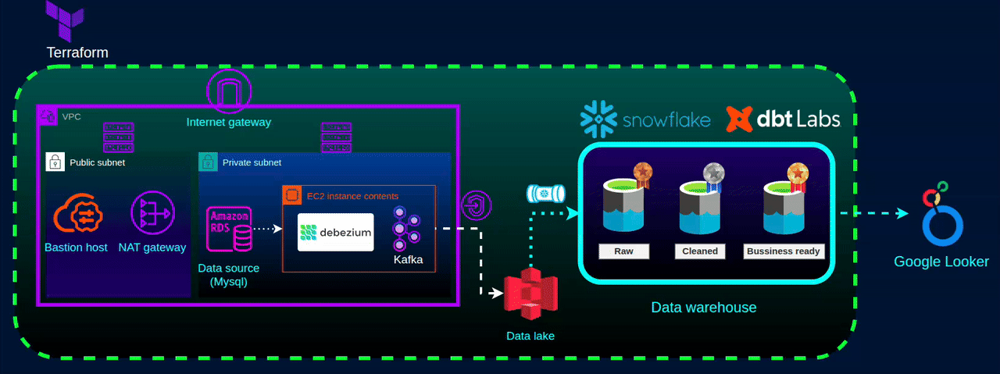

# End-to-End Real-Time CDC Platform (AWS → Snowflake) — 100% Terraform

A portfolio-grade, production-inspired data platform that turns **OLTP changes** in **Amazon RDS MySQL** into **analytics-ready tables** in **Snowflake** — automatically, securely, and reproducibly.

**MySQL (binlog CDC) → Debezium → Kafka → Parquet on S3 → Snowpipe auto-ingest → Snowflake → dbt Cloud**

What makes this project fun (and realistic) isn’t “moving data”. It’s the *platform thinking*: private networking, event-driven ingestion, and a multi-provider Terraform handshake that requires a real convergence pass.

---

## Architecture (GIF)



---

## Highlights (what a reviewer should notice)

- **End-to-end Infrastructure as Code (Terraform)** across **AWS + Snowflake + dbt Cloud** (not “AWS-only IaC”).
- **Log-based CDC** from MySQL binlogs (real change semantics; not polling).
- **Event-driven ingestion**: files landing in S3 automatically trigger **Snowpipe** (no cron-style ingestion loops).
- **Security-first networking**: only a **bastion** is public; data services live in private subnets.
- **Analytics engineering mindset**: a layered warehouse model (landing → staging → history → marts), designed for change and scale.

---

## Table of contents

- [The problem this solves](#the-problem-this-solves)
- [End-to-end flow (high-level, end-to-end)](#end-to-end-flow-high-level-end-to-end)
- [Security & network flow](#security--network-flow)
- [Why these tools (and why this architecture)](#why-these-tools-and-why-this-architecture)
- [Data modeling approach (RAW → STAGING → SNAPSHOTS → MARTS)](#data-modeling-approach-raw--staging--snapshots--marts)
- [How to run (Terraform init/plan/apply + why apply twice)](#how-to-run-terraform-initplanapply--why-apply-twice)
- [Repository structure](#repository-structure)
- [Production-minded improvements](#production-minded-improvements)
- [Skills demonstrated](#skills-demonstrated)

---

## The problem this solves

Many “ETL demos” look fine on a diagram, but break down in practice because they:

- **Poll full tables** (slow, costly, not truly real-time)
- **Trade away security** (public databases, open ports, ad-hoc access)
- **Depend on manual steps** (someone has to push buttons when data arrives)

This project is built around a different goal:

- Capture **only what changed** (CDC)
- Prefer **private paths** for data movement
- Use **events** to trigger ingestion
- Use **managed services** where they reduce operational overhead

---

## End-to-end flow (high-level, end-to-end)

### 1) Source: Amazon RDS MySQL

- The source database runs in a **private subnet**.
- CDC is enabled by configuring MySQL to emit **row-level binary log** changes (the foundation for log-based CDC).

### 2) Change capture: Debezium

- Debezium reads MySQL’s logs and produces **structured change events**.
- This preserves **insert/update/delete semantics** instead of just “latest state”.

### 3) Streaming backbone: Kafka

- Kafka acts as a **durable buffer** between the source system and downstream consumers.
- It decouples change capture (Debezium) from storage/warehouse ingestion (S3/Snowflake), so each part can evolve independently.

### 4) Lake landing zone: S3 + Parquet

- Events are written to S3 as **Parquet** (efficient columnar storage and a stable boundary between streaming and warehousing).
- The layout is organized by dataset (e.g., customers/accounts/transactions), which keeps ingestion and governance clean.

### 5) Warehouse ingestion: Snowpipe

- Snowpipe auto-ingests new objects as they land in S3.
- This is the “automation edge”: no polling jobs, no manual ingestion steps.

### 6) Transformations: dbt Cloud + Snowflake

- Transformations run *in Snowflake* and are orchestrated by dbt Cloud.
- The result is analytics-ready models (dimensions/facts) built from change-aware raw data.

---

## Security & network flow

This project is intentionally designed with a “private by default” posture.

### Network intent

- **Public subnet**: a single controlled entry point (**bastion host**).
- **Private subnet(s)**: data services (Kafka/Debezium host, RDS) that should not be directly reachable from the internet.

### Traffic flow (what can talk to what)

1. You connect to the **bastion** from a restricted IP range.
2. From the bastion, you can access **private** resources (jump host pattern).
3. Private compute can reach required external services for updates via controlled egress.
4. Data lands in **S3**, and Snowpipe ingests from there into **Snowflake**.

### Why this matters

It protects both:

- **Resources** (minimizes public attack surface)
- **Data access paths** (keeps database and streaming components off the public internet)

---

## Why these tools (and why this architecture)

### Terraform (end-to-end IaC)

This project uses Terraform to provision and connect:

- AWS infrastructure (network, compute, storage, IAM, RDS)
- Snowflake objects (ingestion + warehouse structures)
- dbt Cloud orchestration (project/job wiring)

The real value is the **cross-service wiring**: data platforms are mostly integration, permissions, and lifecycle management.

### Log-based CDC (Debezium)

Log-based CDC is chosen because it:

- Minimizes load on the source system (no repeated scanning)
- Improves latency (changes stream as they happen)
- Preserves business meaning (insert/update/delete events)

### Kafka (decoupling + replay)

Kafka provides:

- A replayable event log (rebuild downstream if needed)
- Buffering during spikes (smoother downstream writes)
- Clean separation of responsibilities (capture vs consume)

### S3 + Parquet (stable contract)

Parquet on S3 gives:

- Low-cost, durable storage
- Columnar compression for downstream efficiency
- A clear “handoff point” between streaming and warehouse ingestion

### Snowpipe (event-driven ingestion)

Snowpipe is used because it’s:

- Managed and serverless
- Naturally event-driven (ingests when data arrives)
- Operationally lightweight compared to custom ingestion services

### dbt Cloud (orchestration without operating a scheduler)

dbt Cloud is chosen to demonstrate modern analytics engineering while keeping the project:

- Low-ops (no self-managed Airflow/metadata DB/worker fleet)
- Cost-aware (compute runs where it makes sense: Snowflake)
- Cleanly governed (models/tests/docs as code)

---

## Data modeling approach (RAW → STAGING → SNAPSHOTS → MARTS)

The warehouse design follows a pragmatic layered approach:

- **RAW**: minimally transformed landing data (schema-flexible; great for CDC ingestion)
- **STAGING**: typed, de-duplicated, “current view” models suitable for downstream joins
- **SNAPSHOTS**: history tracking (Slowly Changing Dimension style) to preserve how entities changed over time
- **MARTS**: analytics-ready dimensions and facts for reporting and dashboards

This structure makes the pipeline easier to reason about, test, and evolve.

---

## How to run (Terraform init/plan/apply + why apply twice)

This is intentionally short: the “portfolio value” is the multi-provider wiring and convergence.

### 1) Init / plan / apply

```bash
cd terraform
terraform init
terraform plan
terraform apply
```

### 2) Apply again (Phase 2) — required

```bash
terraform apply
```

### Why apply twice?

Because this platform includes **cross-provider handshakes** where AWS configuration needs identifiers that **only exist after Snowflake creates them**.

In practice:

- **Phase 1** creates the Snowflake ingestion resources so Terraform can discover the generated IDs/channels.
- **Phase 2** finalizes AWS-side wiring (IAM trust + S3 event notifications) using those now-known values.

For the exact operational notes used during development (SSH tunnels, connector registration, etc.), see `terraform/init.txt` and `terraform/init2.txt`.

---

## Repository structure

- `terraform/` — multi-provider Terraform (AWS + Snowflake + dbt Cloud)
- `kafka-debezium/` — Kafka/Debezium runtime assets
- `fake-gen/` — synthetic dataset + schema
- `dbt_snowflake_trans/` — dbt project (models, snapshots, tests)
- `pictures/` — architecture GIF

---

## Production-minded improvements

This is a portfolio system built to demonstrate platform thinking with manageable scope. If hardening for production, I would typically add:

- HA and managed streaming (e.g., MSK / multi-broker architecture)
- Centralized secrets management (AWS Secrets Manager / SSM)
- Observability (pipeline SLAs, ingestion metrics, dbt run alerts)
- Data contracts & governance (schema/versioning strategy)
- Failure handling (dead-letter/quarantine flows)

---

## Skills demonstrated

- End-to-end Terraform across multiple providers
- Security-first network design (bastion + private subnets + controlled egress)
- Log-based CDC architecture and event-driven ingestion
- Lakehouse-style landing patterns (S3 + Parquet) integrated with Snowflake
- Analytics engineering and dimensional modeling mindset with dbt
